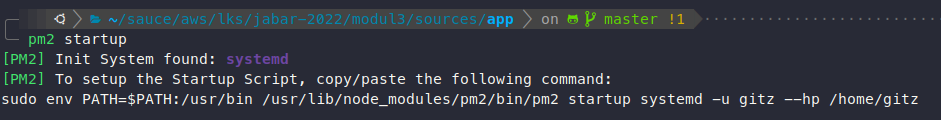

# LKS SMK Tingkat Provinsi Jawa Barat Bidang Cloud Computing - Modul 3
1. Make sure that you have created the require tables (**users** and **notes**) on RDS Aurora Serverless database. The queries used to create required tables for the project is located: https://gist.github.com/itsgitz/4653491aa53747a0982ce6b781259514
2. Download or clone this repository into your EC2 Instance machine
3. Install `pm2` for process manager and `nodejs` (latest LTS version) application server on your EC2 Instance machine
4. Create `pm2` startup for generate startup scripts and configure them in order to keep your process list intact across expected or unexpected machine restarts. For create the startup script, run the following command:
* `$ pm2 startup`
5. The command above will show the following **example** output:

6. Copy/paste the generated command as shown by the above picture to your terminal (EC2 instance system), **for example**:
* `$ sudo env PATH=$PATH:/usr/bin /usr/lib/node_modules/pm2/bin/pm2 startup systemd -u gitz --hp /home/gitz`
7. Install all nodejs dependencies with the following command:
* `$ npm install`
8. Rename or copy the `.env.example` to `.env`
9. Update the following environment variables:
* `APP_ENV` = `production`
* `APP_ID` = `your-participant-id`
* `APP_DEVOPS_NAME` = `Your Name`
* `AWS_REGION` = `your-selected-region`
* `AWS_ELASTIC_CACHE_HOST` = `redis-cluster-host-address`
* `AWS_ELASTIC_CACHE_PORT` = `redis-cluster-port`
* `AWS_SECRET_MANAGER_ARN` = `secret-manager-arn`
* `AWS_RDS_ARN` = `rds-arn`
* `AWS_RDS_DB` = `databasename`
10. Run the command below for build or run your application
	`$ npm run start`
11. The application will listen on port `3000`
12. Important commands for your deployment process:
* `$ npm run stop` for stop the application on current process
* `$ npm run ls` show `pm2` list processes
* `$ npm run log` show your application log for debugging process
